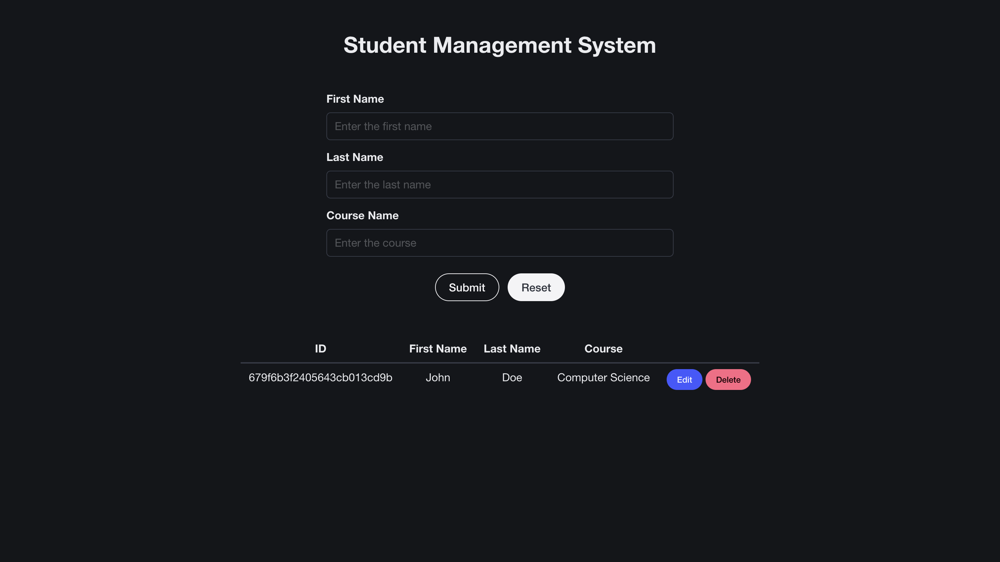

# Node Student Management System

A Node application for a Student Management System with CRUD operations, created using Express and MongoDB

## Running the Application

Run the commands below and access the application from `localhost:8080`

Starting the frontend - `cd frontend && npm start` 
 
Starting the server - `cd server && npm start`

## Application Preview

